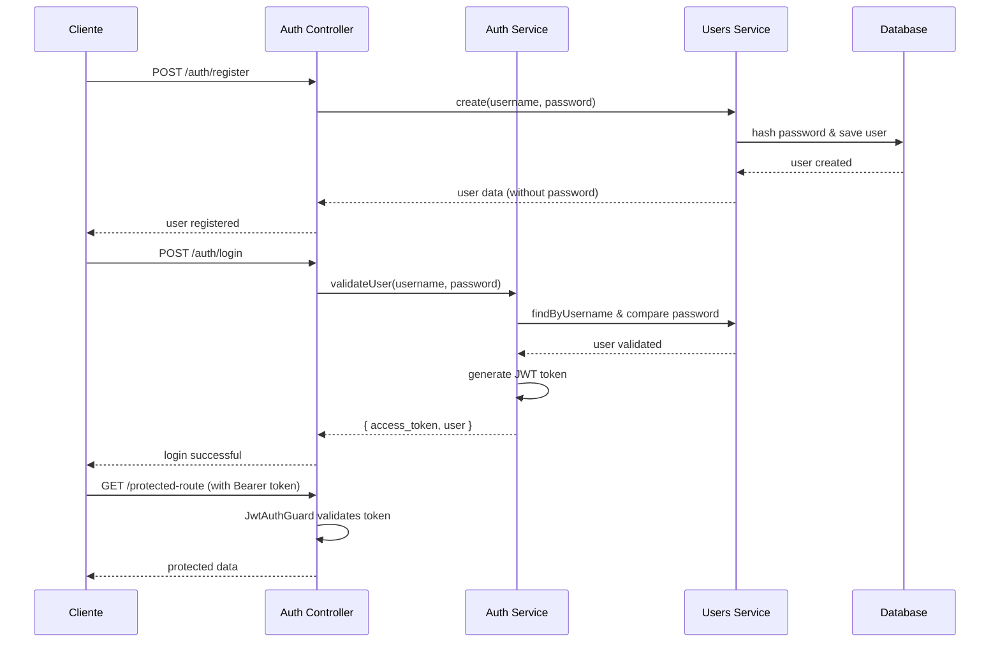

# 🔐 Sistema de Autenticação JWT - API Topos Criativos

## Visão Geral

Sistema completo de autenticação JWT implementado para proteger todos os endpoints da API. Utiliza bcrypt para hash de senhas e tokens JWT com expiração de 24 horas.

---

## 📁 Estrutura dos Módulos

### **Users Module** (`/src/users/`)
Gerencia o cadastro e validação de usuários do sistema.

```
users/
├── dto/
│   └── create-user.dto.ts      # DTO para criação de usuário
├── entities/
│   └── user.entity.ts          # Entidade User (TypeORM)
├── users.service.ts            # Lógica de negócio dos usuários
└── users.module.ts             # Módulo de usuários
```

### **Auth Module** (`/src/auth/`)
Controla autenticação, login e proteção de rotas.

```
auth/
├── dto/
│   └── login.dto.ts            # DTO para login
├── guards/
│   ├── jwt-auth.guard.ts       # Guard JWT para proteção
│   └── local-auth.guard.ts     # Guard local para login
├── strategies/
│   ├── jwt.strategy.ts         # Estratégia JWT do Passport
│   └── local.strategy.ts       # Estratégia local do Passport
├── auth.controller.ts          # Controller de autenticação
├── auth.service.ts             # Lógica de autenticação
└── auth.module.ts              # Módulo de autenticação
```

---

## 🗄️ Banco de Dados

### **Tabela Users**
```sql
CREATE TABLE users (
    id SERIAL PRIMARY KEY,
    username VARCHAR UNIQUE NOT NULL,
    password VARCHAR NOT NULL,
    created_at TIMESTAMPTZ DEFAULT NOW(),
    updated_at TIMESTAMPTZ DEFAULT NOW()
);
```

---

## 🔧 Configuração

### **Variáveis de Ambiente (.env)**
```env
JWT_SECRET=sua_chave_secreta_super_segura_aqui_123456
JWT_EXPIRES_IN=24h
```

### **Dependências Instaladas**
```bash
npm install @nestjs/jwt @nestjs/passport passport passport-jwt passport-local bcryptjs
npm install --save-dev @types/passport-jwt @types/passport-local @types/bcryptjs
```

---

## 🚀 Endpoints de Autenticação

### **1. Registrar Usuário**
```http
POST /auth/register
Content-Type: application/json

{
    "username": "admin",
    "password": "123456"
}
```

**Resposta de Sucesso:**
```json
{
    "id": 1,
    "username": "admin",
    "created_at": "2024-01-15T10:30:00.000Z",
    "updated_at": "2024-01-15T10:30:00.000Z"
}
```

### **2. Login (Obter Token)**
```http
POST /auth/login
Content-Type: application/json

{
    "username": "admin",
    "password": "123456"
}
```

**Resposta de Sucesso:**
```json
{
    "access_token": "eyJhbGciOiJIUzI1NiIsInR5cCI6IkpXVCJ9...",
    "user": {
        "id": 1,
        "username": "admin"
    }
}
```

---

## 🛡️ Proteção de Rotas

### **Endpoints Protegidos**
Todos os endpoints principais agora requerem autenticação JWT:

- ✅ `GET/POST /customer`
- ✅ `GET/POST /product` 
- ✅ `GET/POST /orders`
- ✅ `GET/POST /list-shopping`

### **Endpoints Públicos**
- 🔓 `POST /auth/register`
- 🔓 `POST /auth/login`

### **Como Usar o Token**
Adicione o header em todas as requisições protegidas:
```http
Authorization: Bearer SEU_TOKEN_AQUI
```

---

## 🔒 Segurança Implementada

### **Hash de Senhas**
- Utiliza **bcryptjs** com salt rounds = 10
- Senhas nunca são armazenadas em texto plano
- Comparação segura durante login

### **JWT Tokens**
- **Algoritmo**: HS256
- **Expiração**: 24 horas
- **Payload**: `{ username, sub: userId }`
- **Validação**: Automática via Passport JWT Strategy

### **Guards de Proteção**
- **JwtAuthGuard**: Protege rotas que requerem autenticação
- **LocalAuthGuard**: Valida credenciais no login

---

## 📋 Fluxo de Autenticação



---

## 🧪 Testando no Postman

### **1. Configuração da Collection**
```json
{
    "auth": {
        "type": "bearer",
        "bearer": [
            {
                "key": "token",
                "value": "{{access_token}}",
                "type": "string"
            }
        ]
    }
}
```

### **2. Variáveis de Ambiente**
```json
{
    "base_url": "http://localhost:3001",
    "access_token": ""
}
```

### **3. Script de Login (Tests tab)**
```javascript
if (pm.response.code === 200) {
    const response = pm.response.json();
    pm.environment.set("access_token", response.access_token);
}
```

---

## ⚠️ Considerações de Segurança

### **Produção**
- Altere `JWT_SECRET` para uma chave forte e única
- Use HTTPS em produção
- Implemente rate limiting
- Considere refresh tokens para sessões longas

### **Desenvolvimento**
- Tokens expiram em 24h (configurável)
- Senhas são hasheadas automaticamente
- Validação de entrada nos DTOs

---

## 🔄 Possíveis Melhorias Futuras

- [ ] Refresh Tokens
- [ ] Rate Limiting
- [ ] Roles e Permissions
- [ ] Password Reset
- [ ] Account Verification
- [ ] Session Management
- [ ] Audit Logs

---

**Implementado por:** Amazon Q Developer  
**Data:** Janeiro 2024  
**Versão:** 1.0.0